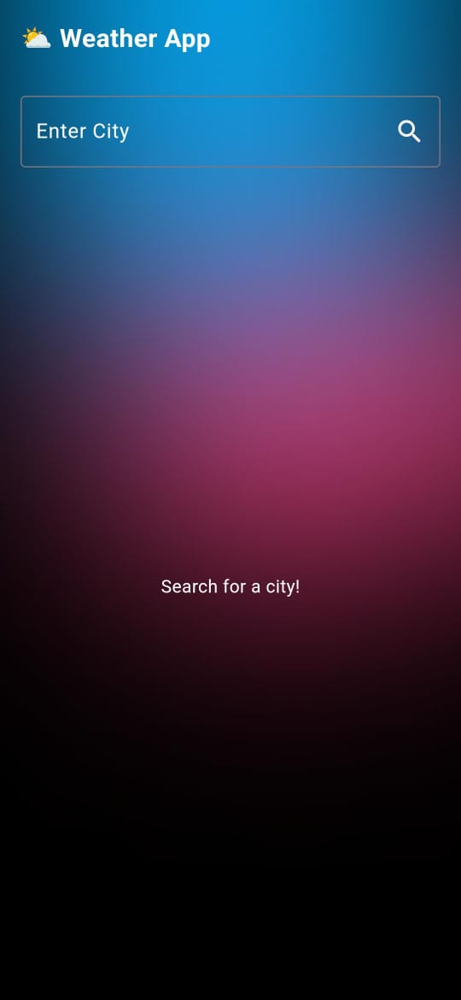

# 🌤️ Weather App

  

The **Weather App** is a Flutter-based mobile application that provides real-time weather updates using REST API integration. Built with the BLoC (Business Logic Component) pattern, this app ensures seamless data flow and a responsive user interface. It's a modern solution for displaying weather information with an engaging and clean UI.

## 🚀 Features

- ☁️ **Real-Time Weather Updates**: Fetches live weather data from a reliable API.
- 🌍 **Global Coverage**: Check weather conditions for any city around the world.
- 🔄 **Dynamic UI**: Displays weather changes with visually appealing animations.
- 🔧 **State Management**: Built with the BLoC pattern for efficient and maintainable code.
- 📱 **Responsive Design**: Optimized for various screen sizes and devices.
  
## 📱 Screenshots

| Home Screen | Weather Detail | 
|:-----------:|:-----------------:|
|  |  |

## 📦 Installation

Follow these steps to get started with the Weather App:

1. **Clone the repository**:
   https://github.com/huzaifaAhmad9/Weather-App-Flutter.git

2. **Navigate to the project directory**:
   cd design

3. **Install the required dependencies**:
   flutter pub get

4. **Run the app**:
   flutter run

## 🛠 Built With

- Flutter - A UI toolkit for building natively compiled applications for mobile from a single codebase.
- Dart - Programming language optimized for building mobile, desktop, server, and web applications.
- REST API - Integration for fetching real-time weather data.
- BLoC Pattern - For effective state management and scalability.

## 🧑‍💻 Contributing

We welcome contributions to enhance the Weather App. To contribute, follow these steps:
- Fork the repository.
- Create a new branch (git checkout -b feature/YourFeature).
- Commit your changes (git commit -m 'Add some feature').
- Push to the branch (git push origin feature/YourFeature).
- Open a pull request.

## 👤 Contact

Feel free to reach out if you have any questions or suggestions:

- **Email**: huzaifaahmad4001@gmail.com
